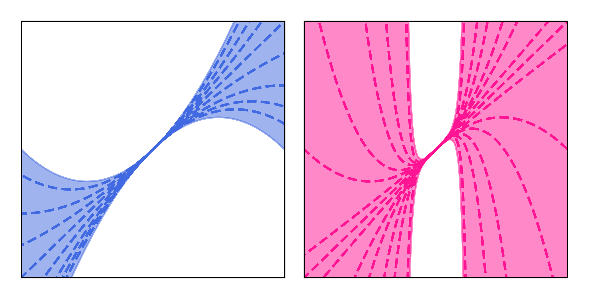

<h1 align="center">
Fromage 🧀 optimiser
</h1>

<p align="center">
  
</p>

<p align="center">
  <a href="https://jeremybernste.in" target="_blank">Jeremy&nbsp;Bernstein</a> &emsp; <b>&middot;</b> &emsp;
  <a href="http://latentspace.cc/arash_vahdat/" target="_blank">Arash&nbsp;Vahdat</a> &emsp; <b>&middot;</b> &emsp;
  <a href="http://www.yisongyue.com" target="_blank">Yisong&nbsp;Yue</a> &emsp; <b>&middot;</b> &emsp;
  <a href="http://mingyuliu.net/" target="_blank">Ming&#8209;Yu&nbsp;Liu</a>
</p>

## Voulez-vous du fromage?

To get started with Fromage in your Pytorch code, copy the file `fromage.py` into your project directory, then write:
```
from fromage import Fromage
optimizer = Fromage(net.parameters(), lr=0.01)
```
We found an initial learning rate of 0.01 worked well in all experiments except model fine-tuning, where we used 0.001. You may want to experiment with learning rate decay schedules.

## About this repository

We've written an academic paper that proposes an optimisation algorithm based on a new geometric characterisation of deep neural networks. The paper is called:

> [On the distance between two neural networks and the stability of learning](https://arxiv.org/abs/2002.03432).

We're putting this code here so that you can test out our optimisation algorithm in your own applications, and also so that you can attempt to reproduce the experiments in our paper.

If something isn't clear or isn't working, let us know in the *Issues section* or contact [bernstein@caltech.edu](mailto:bernstein@caltech.edu).

## Repository structure

Here is the structure of this repository.

    .
    ├── classify-cifar/         # CIFAR-10 classification experiments.
    ├── classify-imagenet/      # Imagenet classification experiments.
    ├── classify-mnist/         # MNIST classification experiments.
    ├── transformer-wikitext2/   # Transformer training experiments.
    ├── generate-cifar/         # CIFAR-10 class-conditional GAN experiments.
    ├── make-plots/             # Code to reproduce the figures in the paper.
    ├── LICENSE                 # The license on our algorithm.
    ├── README.md               # The very page you're reading now.
    └── fromage.py              # Pytorch code for the Fromage optimiser.
    
## Acknowledgements

- This research was supported by [Caltech](https://www.caltech.edu/) and [NVIDIA](https://www.nvidia.com/).
- Our code is written in [Pytorch](https://pytorch.org/).
- Our GAN implementation is based on a codebase by [Jiahui Yu](http://jiahuiyu.com/).
- Our Transformer code is from [🤗 Transformers](https://github.com/huggingface/transformers).
- Our CIFAR-10 classification code is orginally by [kuangliu](https://github.com/kuangliu/pytorch-cifar).
- Our MNIST code was originally forked from the [Pytorch example](https://github.com/pytorch/examples/tree/master/mnist).
- See [here](https://arxiv.org/abs/1708.03888) and [here](https://people.eecs.berkeley.edu/~youyang/publications/batch32k.pdf) for closely related work by [Yang You](https://people.eecs.berkeley.edu/~youyang/), [Igor Gitman](https://scholar.google.com/citations?user=8r9aWLIAAAAJ&hl=en) and [Boris Ginsburg](https://scholar.google.com/citations?user=7BRYaGcAAAAJ&hl=nl).

## Citation

If you adore le fromage as much as we do, feel free to cite [the paper](https://arxiv.org/abs/2002.03432):

```
@misc{fromage2020,
    title={On the distance between two neural networks and the stability of learning},
    author={Jeremy Bernstein and Arash Vahdat and Yisong Yue and Ming-Yu Liu},
    year={2020},
    eprint={arXiv:2002.03432}
}
```

## License

We are making our algorithm available under a [CC BY-NC-SA 4.0](https://creativecommons.org/licenses/by-nc-sa/4.0/) license. The other code we have used obeys other license restrictions as indicated in the subfolders.
